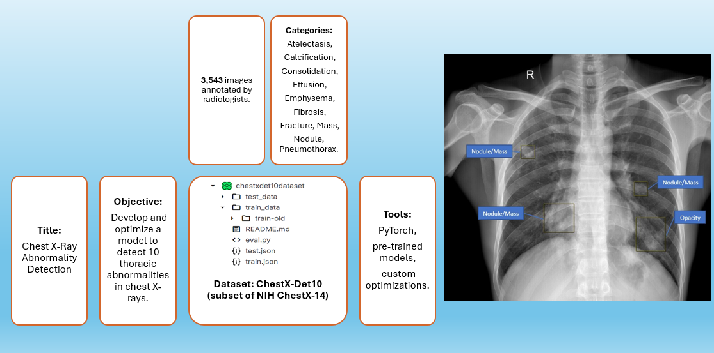
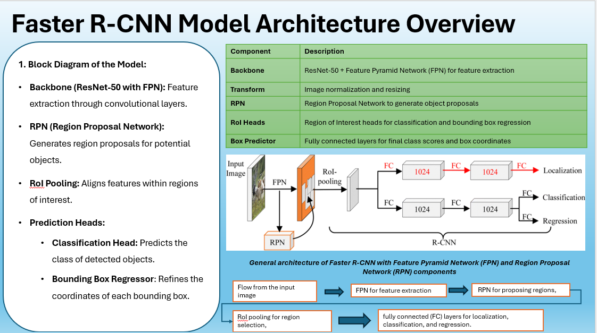

# 🩺 Thoracic Abnormality Detection: YOLOv8 and Faster R-CNN 🖼️


This project leverages advanced object detection architectures to identify thoracic abnormalities in chest X-rays. We aim to compare **YOLOv8** (single-stage) and **Faster R-CNN** (two-stage) models, optimizing their performance for real-world medical diagnostics. 🩻

## Project Overview



---

## 🎯 **Purpose of the Project**
Chest X-rays are a crucial diagnostic tool for thoracic diseases. This project seeks to:
- 🔍 **Train and Evaluate**: Develop models for detecting abnormalities like Consolidation, Nodule, and Pneumothorax.
- ⚖️ **Compare Architectures**: Analyze YOLOv8 and Faster R-CNN in terms of speed, accuracy, and precision.
- 🛠️ **Optimize Performance**: Apply techniques like class-weighting, augmentation, and learning rate adjustment.
- 📊 **Provide Insights**: Highlight the strengths and weaknesses of each architecture in real-world applications.

---

## 📂 **Dataset Overview**
### Dataset: [ChestX-Det10](https://www.kaggle.com/datasets) 

The dataset includes 3,543 chest X-ray images annotated with bounding boxes for 10 thoracic abnormalities, including Nodule, Mass, and Pneumothorax. This project uses the ChestX-Det10 dataset, a subset of NIH ChestX-14.
The dataset includes chest X-rays annotated with bounding boxes for 10 thoracic abnormalities:
- **Classes**: 
  - Consolidation, Pneumothorax, Emphysema, Calcification, Nodule, Mass, Fracture, Effusion, Atelectasis, Fibrosis.
- **Statistics**:
  - Training Images: **3,001**
  - Testing Images: **1,000+**
  - Missing Data: **22.69% treated as background.**

---

## 🛠️ **Project Workflow**
1. **Data Preparation** 📦
   - Organize the dataset into YOLO-compatible format (`images/`, `labels/`).
   - Convert annotations from `train.json` and `test.json` to YOLO format.
   - Handle missing data by treating unannotated images as background.
   
2. **Model Architectures** 🤖
   - **YOLOv8 (Single-Stage Detection)**:
     - Fast and lightweight, optimized for real-time applications.
   - **Faster R-CNN (Two-Stage Detection)**:
     - Accurate and reliable, with ResNet-50 backbone for feature extraction.
     
3. **Training Configuration** 🏋️‍♀️
   - Data augmentation: Mosaic, horizontal flipping, CutMix.
   - Optimizer: AdamW for YOLOv8, SGD for Faster R-CNN.
   - Custom class weighting for imbalance correction.

4. **Evaluation** 📊
   - Compare metrics like Precision, Recall, mAP@0.5, and mAP@0.5:0.95.

---

## Overview of Faster R-CNN 🖼️

Faster R-CNN is a state-of-the-art two-stage object detection framework designed for high accuracy in identifying objects within an image. Below is a detailed explanation of its architecture:

---

### 🔑 **Key Components**
- **Backbone**:
  - ResNet-50 with a Feature Pyramid Network (FPN) is used for extracting rich, multi-scale features from input images.
- **RPN (Region Proposal Network)**:
  - Proposes candidate regions in the image that may contain objects.
- **RoI Pooling**:
  - Aligns features from the proposed regions into a uniform size for further processing.
- **Prediction Heads**:
  - **Classification Head**: Predicts the object categories within the proposed regions.
  - **Bounding Box Regressor**: Refines the coordinates of bounding boxes for better localization.

---

### 🛠️ **Workflow**
1. **Input Image Processing**:
   - The input image is fed into the backbone for feature extraction.
2. **Feature Extraction (FPN)**:
   - Multi-scale features are generated by the FPN for different levels of abstraction.
3. **Region Proposal Network (RPN)**:
   - Generates candidate bounding boxes or "region proposals."
4. **RoI Pooling**:
   - Extracts fixed-size feature maps from each region proposal.
5. **Prediction**:
   - The extracted features are passed through fully connected layers to:
     - **Classify objects** within regions of interest.
     - **Refine bounding box coordinates** for better accuracy.




This snapshot illustrates the general architecture of Faster R-CNN, including key components like the Feature Pyramid Network (FPN), Region Proposal Network (RPN), and prediction heads for classification and regression.

---

## 🚀 **How to Run the Project**
### 1️⃣ Clone the Repository
```bash
git clone https://github.com/yasirusama61/YOLOv8-Object-Detection.git
cd thoracic-abnormality-detection
```
## 📊 Results

### Faster R-CNN Metrics:
- **AP@25**: 0.62
- **AP@50**: 0.56
- **AP@75**: 0.48
- **Details**: Implemented CBAM attention mechanism and trained with ResNet-50 backbone. Performed well on larger abnormalities like Nodule but faced challenges with smaller regions like Mass.

### YOLOv8 Metrics:
- **Precision**: ~70%
- **Recall**: ~65%
- **mAP@50**: ~0.497
- **mAP@50-95**: ~0.271
- **Details**: Focused on speed and real-time application. Struggled with minority classes but performed robustly on larger, well-represented classes.

### Next Steps:
- Fine-tune both Faster R-CNN and YOLOv8 to address small-region abnormalities.
- Improve dataset balance for minority classes with advanced sampling techniques.

