# 🩺 Thoracic Abnormality Detection: YOLOv8 and Faster R-CNN 🖼️


This project leverages advanced object detection architectures to identify thoracic abnormalities in chest X-rays. We aim to compare **YOLOv8** (single-stage) and **Faster R-CNN** (two-stage) models, optimizing their performance for real-world medical diagnostics. 🩻

## Project Overview


---

## 🎯 **Purpose of the Project**
Chest X-rays are a crucial diagnostic tool for thoracic diseases. This project seeks to:
- 🔍 **Train and Evaluate**: Develop models for detecting abnormalities like Consolidation, Nodule, and Pneumothorax.
- ⚖️ **Compare Architectures**: Analyze YOLOv8 and Faster R-CNN in terms of speed, accuracy, and precision.
- 🛠️ **Optimize Performance**: Apply techniques like class-weighting, augmentation, and learning rate adjustment.
- 📊 **Provide Insights**: Highlight the strengths and weaknesses of each architecture in real-world applications.

---

## 📂 **Dataset Overview**
### Dataset: [ChestX-Det10](https://www.kaggle.com/datasets) 

The dataset includes 3,543 chest X-ray images annotated with bounding boxes for 10 thoracic abnormalities, including Nodule, Mass, and Pneumothorax. This project uses the ChestX-Det10 dataset, a subset of NIH ChestX-14.
The dataset includes chest X-rays annotated with bounding boxes for 10 thoracic abnormalities:
- **Classes**: 
  - Consolidation, Pneumothorax, Emphysema, Calcification, Nodule, Mass, Fracture, Effusion, Atelectasis, Fibrosis.
- **Statistics**:
  - Training Images: **3,001**
  - Testing Images: **1,000+**
  - Missing Data: **22.69% treated as background.**

---

## 📊 **Exploratory Data Analysis (EDA)**

### **1. Class Distribution**
The dataset contains imbalanced classes, as shown in the chart below. This highlights the importance of oversampling, augmentation, or WeightedRandomSampler techniques to manage minority classes effectively.

<div align="center">
  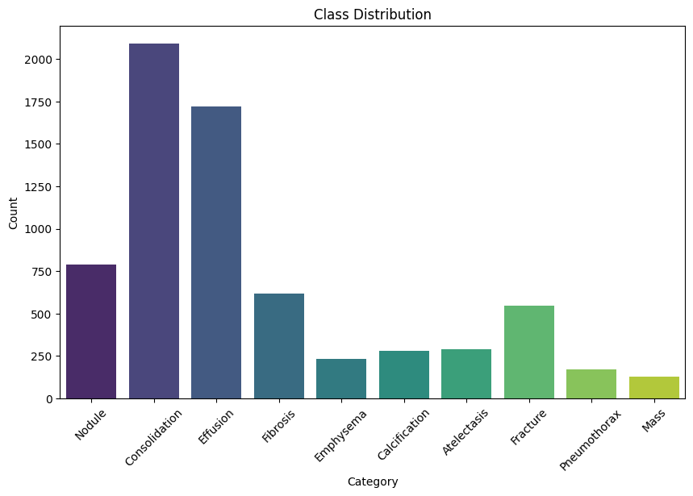
</div>

---

### **2. Bounding Box Distribution**
Analyzing bounding box dimensions helps uncover patterns that can inform preprocessing and augmentation strategies. Below are the width, height, and area distributions of the bounding boxes in the dataset:

#### **Bounding Box Width Distribution**
<div align="center">
  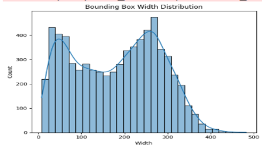
</div>

#### **Bounding Box Height Distribution**
<div align="center">
  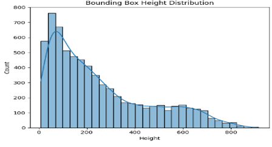
</div>

#### **Bounding Box Area Distribution**
<div align="center">
  
</div>

---
### **Key Insights from EDA**

1. **Class Distribution**:
   - The dataset shows significant class imbalance, with **Consolidation** and **Effusion** being the most common categories, while **Mass** and **Pneumothorax** are underrepresented.
   - This imbalance highlights the need for techniques like **oversampling**, **augmentation**, or **WeightedRandomSampler** to address model bias.

2. **Bounding Box Width, Height, and Area**:
   - **Width and Height**:
     - Most bounding boxes are small, with the majority having widths and heights under 200 pixels.
   - **Area**:
     - Bounding box areas are heavily skewed towards smaller regions, indicating that small abnormalities dominate the dataset.
   - These patterns suggest that the model must handle **small object detection** effectively, which may require **attention mechanisms** (e.g., CBAM) or **multi-scale feature maps** (e.g., FPN).

By addressing these challenges during preprocessing and model design, performance on challenging classes and smaller abnormalities can be significantly improved.

## Baseline Adjustments and Improvements

### Enhanced Class Handling:
- **Weighted Loss**: Improved model performance by addressing class imbalance through weighted loss adjustments.
- **Streamlined Data Augmentation**: Applied advanced augmentation techniques to improve model generalization and robustness.

### Augmentation Techniques Applied:
1. **Random Horizontal Flip**: Simulates flipped X-ray orientations to improve model robustness.
2. **Random Rotation**: Introduces minor rotational variance (±10 degrees) to mimic natural misalignments.
3. **Color Jitter**: Adjusts brightness and contrast to replicate real-world lighting inconsistencies.
4. **Normalization**: Scales pixel values to ensure stable and efficient model convergence.

---

### Optimization:
- Introduced **attention modules** for feature refinement, leading to improved performance:
  - **CBAM (Convolutional Block Attention Module)**: Combines spatial and channel-wise attention to enhance feature selection.

### Impact of Optimization:
- **Training Loss**: Reduced significantly due to better alignment with class distributions.
- **Model Precision and Recall**: Improved metrics after applying weighted loss and attention modules.

Below is the comparison of Precision and Recall before and after applying weighted loss:

<div align="center">
  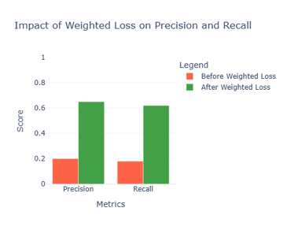
</div>

---

## Visualization of Results

Below is a visualization of the augmented image and the corresponding feature refinements:

<div align="center">
  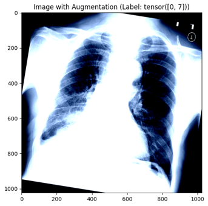
</div>

This section highlights the major adjustments, techniques, and improvements applied to enhance model performance for thoracic abnormality detection.

---

## 🛠️ **Project Workflow**
1. **Data Preparation** 📦
   - Organize the dataset into YOLO-compatible format (`images/`, `labels/`).
   - Convert annotations from `train.json` and `test.json` to YOLO format.
   - Handle missing data by treating unannotated images as background.
   
2. **Model Architectures** 🤖
   - **YOLOv8 (Single-Stage Detection)**:
     - Fast and lightweight, optimized for real-time applications.
   - **Faster R-CNN (Two-Stage Detection)**:
     - Accurate and reliable, with ResNet-50 backbone for feature extraction.
     
3. **Training Configuration** 🏋️‍♀️
   - Data augmentation: Mosaic, horizontal flipping, CutMix.
   - Optimizer: AdamW for YOLOv8, SGD for Faster R-CNN.
   - Custom class weighting for imbalance correction.

4. **Evaluation** 📊
   - Compare metrics like Precision, Recall, mAP@0.5, and mAP@0.5:0.95.

---

## Overview of Faster R-CNN 🖼️

Faster R-CNN is a state-of-the-art two-stage object detection framework designed for high accuracy in identifying objects within an image. Below is a detailed explanation of its architecture:

---

### 🔑 **Key Components**
- **Backbone**:
  - ResNet-50 with a Feature Pyramid Network (FPN) is used for extracting rich, multi-scale features from input images.
- **RPN (Region Proposal Network)**:
  - Proposes candidate regions in the image that may contain objects.
- **RoI Pooling**:
  - Aligns features from the proposed regions into a uniform size for further processing.
- **Prediction Heads**:
  - **Classification Head**: Predicts the object categories within the proposed regions.
  - **Bounding Box Regressor**: Refines the coordinates of bounding boxes for better localization.

---

### 🛠️ **Workflow**
1. **Input Image Processing**:
   - The input image is fed into the backbone for feature extraction.
2. **Feature Extraction (FPN)**:
   - Multi-scale features are generated by the FPN for different levels of abstraction.
3. **Region Proposal Network (RPN)**:
   - Generates candidate bounding boxes or "region proposals."
4. **RoI Pooling**:
   - Extracts fixed-size feature maps from each region proposal.
5. **Prediction**:
   - The extracted features are passed through fully connected layers to:
     - **Classify objects** within regions of interest.
     - **Refine bounding box coordinates** for better accuracy.


This snapshot illustrates the general architecture of Faster R-CNN, including key components like the Feature Pyramid Network (FPN), Region Proposal Network (RPN), and prediction heads for classification and regression.

## Visualization of Training Data Annotations

The following image demonstrates the **training data annotations** used for the YOLO model. The red bounding boxes represent the ground truth regions of interest (ROIs) for various thoracic abnormalities, as labeled in the dataset. These annotations provide the foundation for the model's supervised learning process.

### Key Details:
- **Labels**: The dataset includes annotations for multiple thoracic conditions such as:
  - Effusion
  - Consolidation
  - Calcification
  - Fracture
  - Fibrosis
  - Pneumothorax
  - Mass
  - Atelectasis
  - Emphysema
- **Bounding Boxes**: Each bounding box corresponds to a specific labeled condition in the dataset.
- **Purpose**: These annotated images are used during the training phase to help the model learn to detect and localize abnormalities effectively.

### Example of Training Annotations:
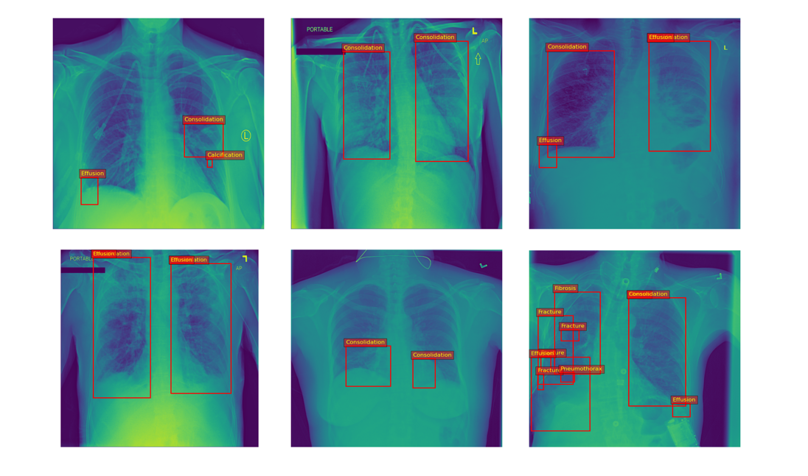

### Notes:
- The bounding boxes and labels are derived directly from the dataset's annotation files.
- The annotations ensure that the model is trained with high-quality ground truth data, critical for achieving accurate predictions during inference.
- Visualizations were generated using Python libraries like Matplotlib and PyPlot for clarity and analysis.

For more details about the dataset and annotation format, refer to the [Dataset Details](#dataset-details) section.


### 📈 Training Loss for Faster R-CNN

The plot below illustrates the training loss over epochs for the Faster R-CNN model. The steady decrease and convergence indicate effective model training and optimization.

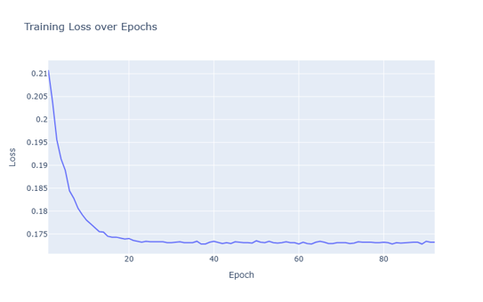

## 📷 Augmented Images and Preprocessing Pipeline

### 🌟 Augmentation for YOLO Training

To enhance the robustness and generalization of the YOLO object detection model, we implemented an augmentation pipeline using **Albumentations**. The augmentations were designed to introduce variability while maintaining the integrity of bounding box annotations in the medical chest X-ray dataset.

### 🔧 **Augmentation Pipeline**

The following transformations were applied during training:

- **Random Rotate 90**: Introduces variability in orientation by rotating images at 90-degree angles.
- **Horizontal Flip**: Simulates flipped X-ray images to increase data diversity.
- **Color Jitter**: Adjusts brightness, contrast, saturation, and hue to mimic real-world lighting inconsistencies.
- **Random Resized Crop**: Crops and resizes images to focus on specific regions while maintaining bounding box alignment.
- **Coarse Dropout**: Randomly drops small regions of the image to mimic obstructions or artifacts (alternative to Cutout).
- **Shift-Scale-Rotate**: Applies slight shifts, scaling, and rotations for variability in image positioning.
- **Normalization**: Scales pixel values to match ImageNet statistics for consistent model convergence.

---

### 🖼️ **Augmented Images**

Below is a grid showcasing some examples of augmented chest X-ray images with their bounding box annotations:

| Consolidation                         | Effusion & Atelectasis                | Bilateral Consolidation              |
|---------------------------------------|---------------------------------------|---------------------------------------|
| .png)  | .png) | .png) |

| Effusion & Atelectasis (Additional Case) | Effusion                              |
|------------------------------------------|---------------------------------------|
| .png) | .png)       |


---

## 🚀 **How to Run the Project**
### 1️. Clone the Repository
```bash
git clone https://github.com/yasirusama61/YOLOv8-Object-Detection.git
cd thoracic-abnormality-detection
```
### 2. Install dependencies:
```bash
pip install requirements.txt
```
## 🛠️ **Data Preparation**

### **Step 1: Convert Annotations to YOLO Format**  
📄 Use the following script to process `train.json` and `test.json`, converting them into YOLO-compatible annotations:

```bash
python scripts/convert_annotations.py
```
  This script:
  - Converts bounding box annotations to YOLO format (class_id x_center y_center width height).
  - Treats missing data (images without bounding boxes) as background by creating empty .txt files.

### **Step 2: Verify Dataset**
  Ensure the following structure:

  ```
  yolo_dataset/
  ├── images/
  │   ├── train/     # Training images
  │   ├── test/      # Testing images
  ├── labels/
  │   ├── train/     # YOLO format labels for training
  │   ├── test/      # YOLO format labels for testing
  ```
## 📊 Results

### Faster R-CNN Metrics:
- **AP@25**: 0.62
- **AP@50**: 0.56
- **AP@75**: 0.48
- **Details**: Implemented CBAM attention mechanism and trained with ResNet-50 backbone. Performed well on larger abnormalities like Nodule but faced challenges with smaller regions like Mass.

## 🖼️ **Detection Results**

### Faster R-CNN Detection Results
Below is a snapshot of the **Faster R-CNN** detection results on chest X-ray images. The model successfully identifies abnormalities such as Consolidation, Nodule, and Pneumothorax, leveraging a **ResNet-50 backbone** and the **ChestX-Det10 dataset**:

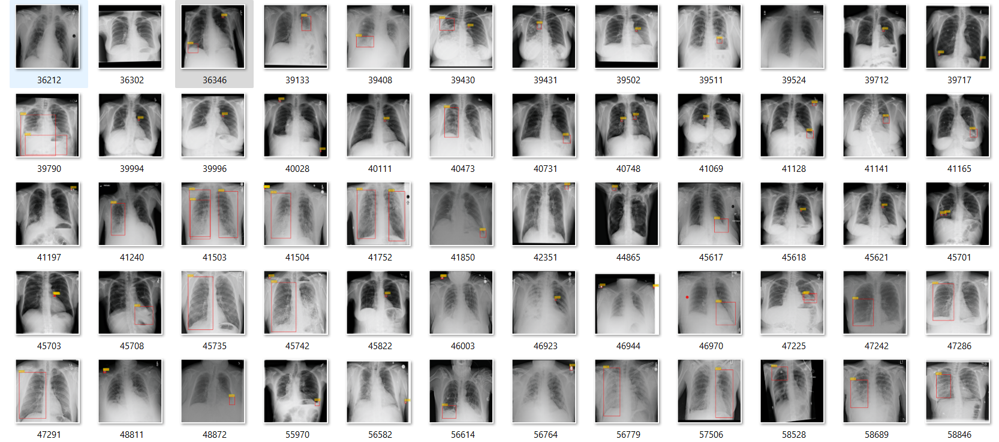

### Key Observations:
- **Red Bounding Boxes**: Detected abnormalities.
- **Yellow Labels**: Identified categories (e.g., Consolidation, Nodule).
- The model demonstrates high accuracy for larger abnormalities but faces challenges with smaller regions.

#### Performance Highlights:
- **mAP@50**: 0.56
- **AP@25**: 0.62
- Focused on achieving better detection for underrepresented classes (e.g., Mass, Pneumothorax) through class weighting and augmentation strategies.

## YOLOv8 Training Results

### Dataset Analysis and Class Distribution

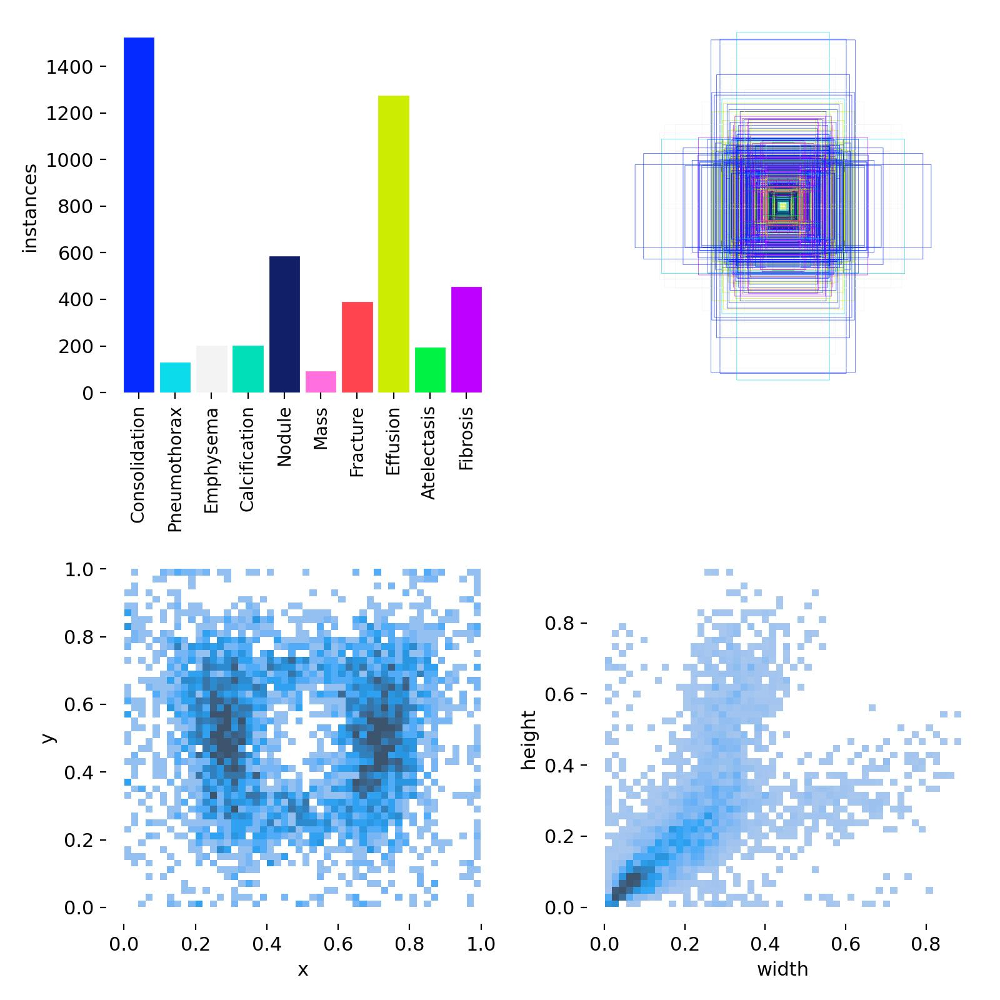

This image showcases:
- **Class Distribution:** Frequency of each class instance in the dataset.
- **Bounding Box Statistics:** Distribution of bounding box sizes and positions.

---

### Training Performance Metrics

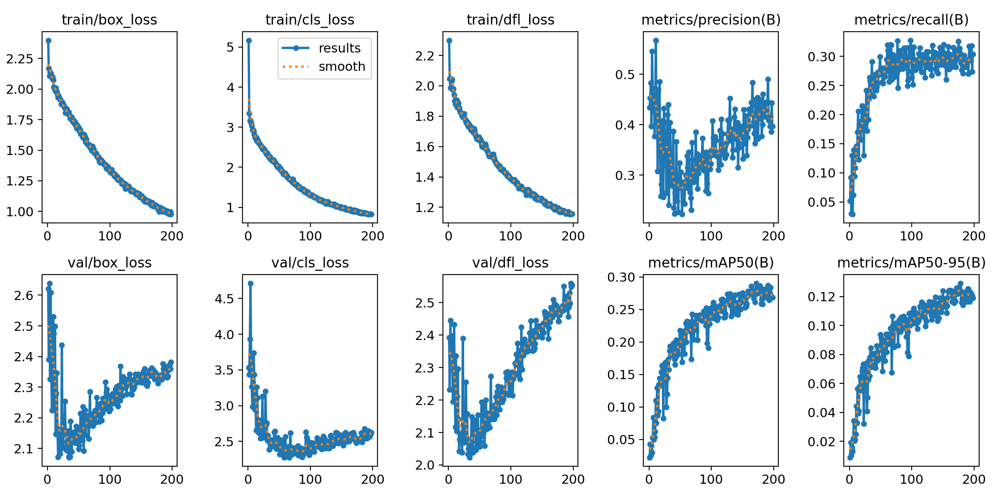

This chart illustrates:
- **Loss Curves:** Tracking the box, classification, and DFL losses for both training and validation sets.
- **Precision and Recall:** Monitoring the improvement over epochs.
- **Mean Average Precision (mAP):** Evaluating the overall model performance across thresholds.

---

### F1-Confidence Curve

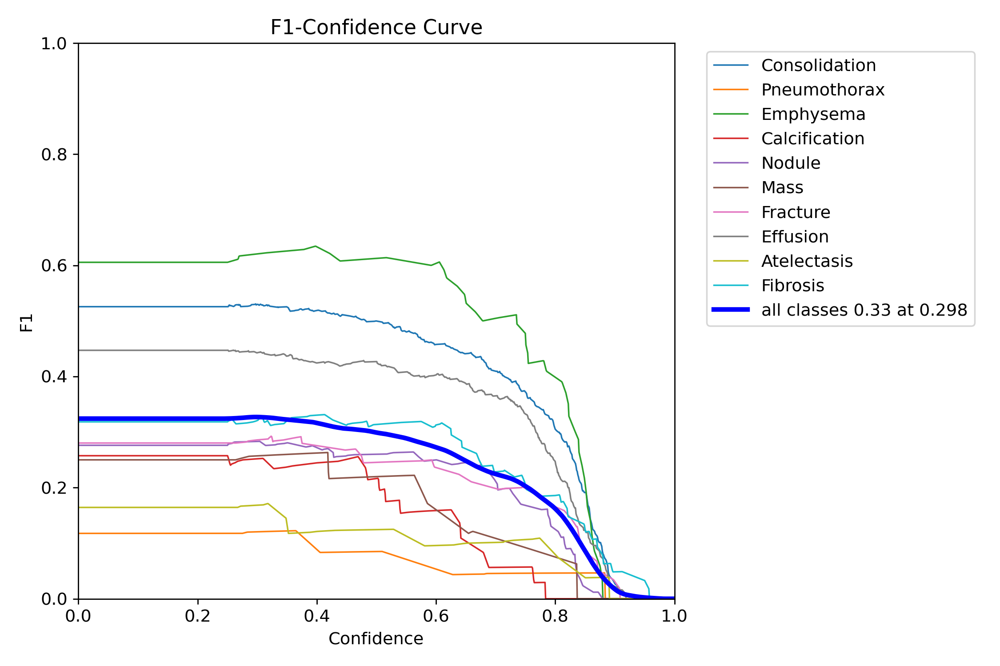

- The F1-Confidence curve represents the balance between precision and recall for various confidence thresholds.
- **Key Insights:** Class-specific F1 scores and overall performance at optimal confidence levels.

### Latest YOLOv8 Results


#### Key Metrics:
- **Precision**: ~78.7%
- **Recall**: ~52.6%
- **mAP@50**: ~61.2%
- **mAP@50-95**: ~42.5%

#### Class-Specific Performance:
| Class           | Instances | Precision (P) | Recall (R) | mAP@50 | mAP@50-95 |
|------------------|-----------|---------------|------------|--------|-----------|
| Consolidation    | 604       | 0.76          | 0.71       | 0.695  | 0.501     |
| Pneumothorax     | 46        | 0.70          | 0.46       | 0.496  | 0.364     |
| Emphysema        | 63        | 0.88          | 0.79       | 0.799  | 0.722     |
| Calcification    | 82        | 0.88          | 0.70       | 0.793  | 0.677     |
| Nodule           | 211       | 0.78          | 0.78       | 0.781  | 0.604     |
| Mass             | 166       | 0.84          | 0.54       | 0.658  | 0.536     |
| Effusion         | 354       | 0.76          | 0.68       | 0.799  | 0.641     |
| Atelectasis      | 109       | 0.79          | 0.43       | 0.558  | 0.470     |
| Fibrosis         | 120       | 0.78          | 0.51       | 0.616  | 0.420     |

---

### Summary:
- The model showed strong performance on well-represented classes but struggled with minority classes.
- Achieved good speed and real-time application capability while maintaining robust performance.
- **Results saved to**: `/kaggle/working/yolo_training/retrain_with_adjustments3`


### Next Steps:
- Fine-tune both Faster R-CNN and YOLOv8 to address small-region abnormalities.
- Improve dataset balance for minority classes with advanced sampling techniques.

## 📚 Acknowledgments

### 🗂️ Dataset
The **ChestX-Det10 dataset**, a subset of the NIH ChestX-14 dataset, provided annotated chest X-ray images essential for training and evaluating the object detection models.  
Reference: [ChestX-ray14 Dataset](https://arxiv.org/abs/1705.02315)

### 📖 Research Contributions
This project builds upon foundational research in computer vision and medical imaging. Notable references include:

- **Wang et al.**: *"ChestX-ray8: Hospital-scale Chest X-ray Database and Benchmarks on Weakly-Supervised Classification and Localization of Common Thorax Diseases."*  
  [DOI:10.1109/CVPR.2017.369](https://doi.org/10.1109/CVPR.2017.369)

- **Rajpurkar et al.**: *"CheXNet: Radiologist-Level Pneumonia Detection on Chest X-Rays with Deep Learning."*  
  [arXiv:1711.05225](https://arxiv.org/abs/1711.05225)
